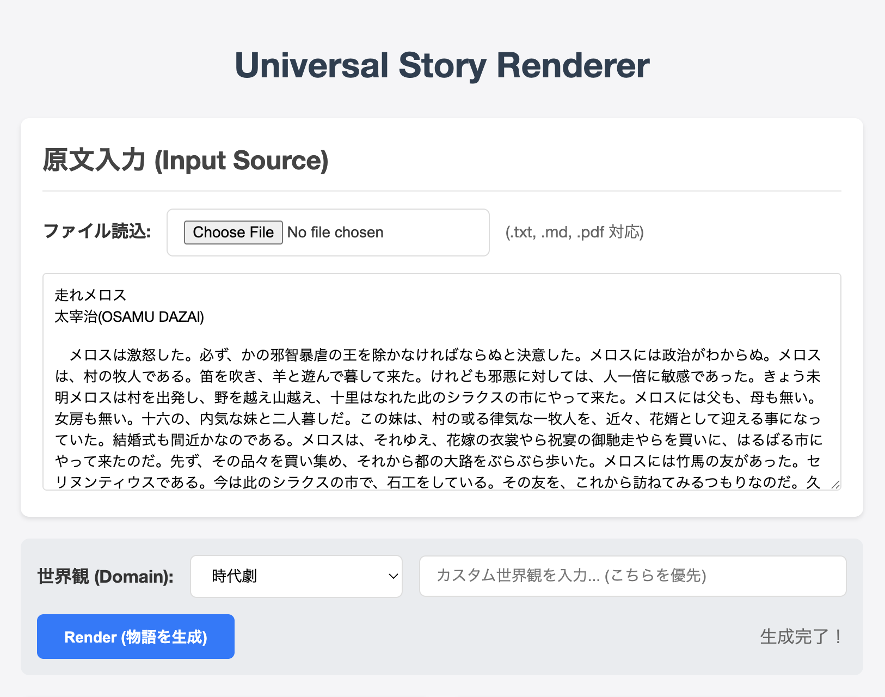
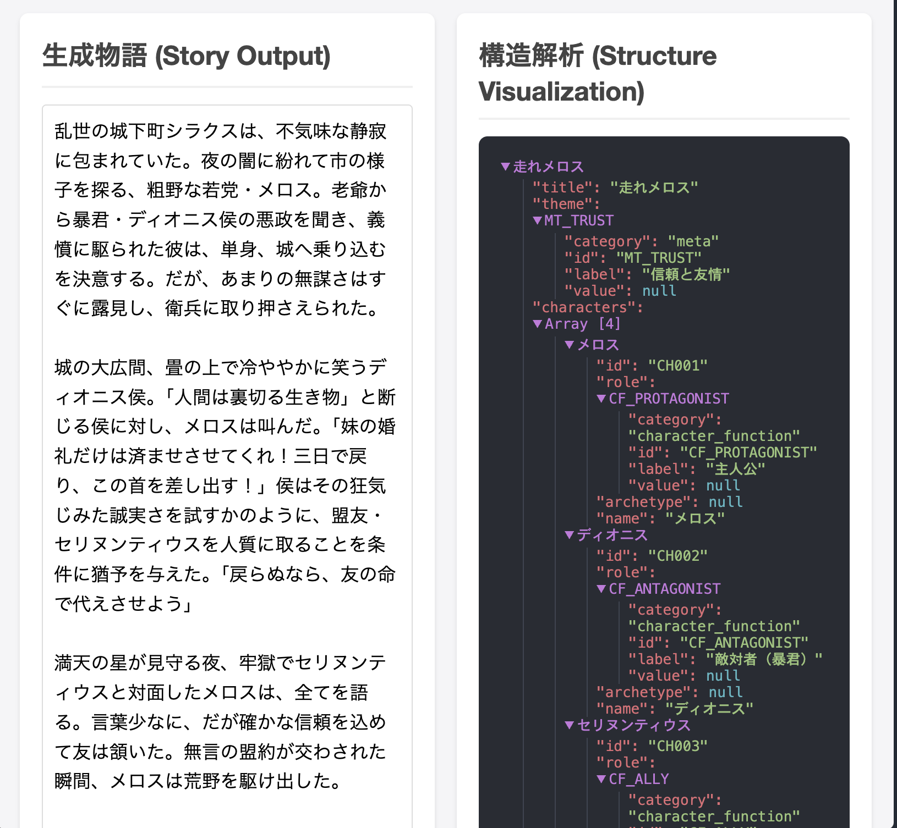

# UniversalStoryRender

**Recompose any story into an original world via contextual abstraction.**

 

[English](#english) | [日本語](#japanese) | [中文](#chinese)

## Demo
### 🚀 [Try Live Demo](https://universal-story-renderer.onrender.com)

<p align="center">
  
  
</p>

---

<a name="english"></a>
## 🇬🇧 English

### Overview
**UniversalStoryRender** is an AI engine that extracts only the "essential structure (The Soul)" from existing stories (novels, scripts, etc.) and reconstructs (Renders) them to fit a target domain (Historical Drama, Sci-Fi, School Youth, etc.).

By using **"Contextual Forgetting"** as the starting point of creation, it intentionally discards the "surface (The Skin)" such as proper nouns and historical settings of the original work. This realizes the universal reuse of stories, transcending copyright and cultural context constraints.

### Key Features
1.  **Contextual Forgetting**
    - Actively detects and discards elements (noise) of the original work that do not fit the target domain.
    - Example: When creating a "Samurai Era" version, settings like "Cross" or "Syracuse" from the original work are automatically forgotten.
2.  **LNA-ES Ontology (Logically Normalized Architecture for Emotional Structures)**
    - Normalizes the story as a conceptual graph (nodes and edges).
    - Quantifies the **Emotional Arc**, maintaining the structure of emotion even in different worldviews.
3.  **Domain Adaptation**
    - Generates stories by applying the vocabulary and style (Style Formula) of the specified domain to the extracted structure.
4.  **Visualizing the "Soul"**
    - Provides a JSON-based visualization of the story's core structure, allowing users to see how the AI interprets the narrative backbone.

### Installation & Usage

#### Prerequisites
- Python 3.10+
- [GLM-4.7 API Key](https://open.bigmodel.cn/) (ZhipuAI)

#### Setup
```bash
git clone https://github.com/lna-lab/UniversalStoryRender.git
cd UniversalStoryRender
pip install -r requirements.txt
```

Create a `.env` file and set your API key:
```bash
GLM_API_KEY=your_api_key_here
```

#### Running the Web Interface
```bash
python3 -m uvicorn src.api.main:app --host 0.0.0.0 --port 8000 --reload
```
Open your browser at `http://localhost:8000`.

### Deployment
This project includes a `Procfile` and is ready for deployment on platforms like Render, Heroku, or Railway.
Ensure you set the `GLM_API_KEY` environment variable in your hosting provider's dashboard.

---

<a name="japanese"></a>
## 🇯🇵 日本語 (Japanese)

### 概要
**UniversalStoryRender** は、既存の物語（小説、脚本など）から「本質的な構造（The Soul）」のみを抽出し、ターゲットとなるドメイン（時代劇、学園青春、SFなど）に合わせて再構成（Rendering）するAIエンジンです。

「**忘却（Contextual Forgetting）**」を創造の起点とし、原作の固有名詞や時代設定といった「表層（The Skin）」を意図的に破棄することで、著作権や文化的コンテキストの制約を超えた、普遍的な物語の再利用を実現します。

### 主な特徴
1.  **Contextual Forgetting (文脈的忘却)**
    - ターゲットドメインにそぐわない原作の要素（ノイズ）を能動的に検出し、破棄します。
    - 例: 時代劇版を作る際、原作の「十字架」や「シラクス」といった設定は自動的に忘却されます。
2.  **LNA-ES Ontology (Logically Normalized Architecture for Emotional Structures)**
    - 物語を概念グラフ（ノードとエッジ）として正規化します。
    - 感情曲線（Emotional Arc）を定量化し、異なる世界観でも感動の構造を維持します。
3.  **Domain Adaptation (ドメイン適応)**
    - 抽出された構造に対し、指定されたドメインの語彙やスタイル（Style Formula）を適用して物語を生成します。
4.  **魂の可視化**
    - 物語のコア構造をJSONツリーとして可視化し、AIがどのように物語の骨子を解釈したかを確認できます。

### インストールと使い方

#### 前提条件
- Python 3.10以上
- [GLM-4.7 API Key](https://open.bigmodel.cn/) (ZhipuAI)

#### セットアップ
```bash
git clone https://github.com/lna-lab/UniversalStoryRender.git
cd UniversalStoryRender
pip install -r requirements.txt
```

`.env` ファイルを作成し、APIキーを設定してください:
```bash
GLM_API_KEY=your_api_key_here
```

#### Webインターフェースの起動
```bash
python3 -m uvicorn src.api.main:app --host 0.0.0.0 --port 8000 --reload
```
ブラウザで `http://localhost:8000` にアクセスしてください。

### デプロイ
本プロジェクトは `Procfile` を含んでおり、Render, Heroku, Railway 等のPaaSへ即座にデプロイ可能です。
ホスティングサービスのダッシュボードで環境変数 `GLM_API_KEY` を設定することを忘れないでください。

---

<a name="chinese"></a>
## 🇨🇳 中文 (Chinese)

### 概述
**UniversalStoryRender** 是一个AI引擎，旨在从现有的故事（小说、剧本等）中提取仅有的“本质结构（The Soul）”，并将其根据目标领域（古装剧、青春校园、科幻等）进行重构（Rendering）。

它以“**语境遗忘（Contextual Forgetting）**”为创造的起点，有意舍弃原著中的专有名词或时代背景等“表层（The Skin）”，从而超越版权和文化语境的限制，实现故事的普遍再利用。

### 主要特点
1.  **Contextual Forgetting (语境遗忘)**
    - 主动检测并舍弃原著中不符合目标领域的要素（噪音）。
    - 例如：在制作“古装剧版”时，原著中的“十字架”或“叙拉古”等设定将被自动遗忘。
2.  **LNA-ES Ontology (Logically Normalized Architecture for Emotional Structures)**
    - 将故事规范化为概念图（节点和边）。
    - 量化情感曲线（Emotional Arc），即使在不同的世界观中也能保持感动的结构。
3.  **Domain Adaptation (领域适应)**
    - 对提取出的结构应用指定领域的词汇和风格（Style Formula）来生成故事。
4.  **灵魂可视化**
    - 将故事的核心结构可视化为JSON树，让用户可以看到AI如何解读故事的骨架。

### 安装与使用

####前提条件
- Python 3.10+
- [GLM-4.7 API Key](https://open.bigmodel.cn/) (ZhipuAI)

#### 设置
```bash
git clone https://github.com/lna-lab/UniversalStoryRender.git
cd UniversalStoryRender
pip install -r requirements.txt
```

创建一个 `.env` 文件并设置您的API密钥：
```bash
GLM_API_KEY=your_api_key_here
```

#### 运行Web界面
```bash
python3 -m uvicorn src.api.main:app --host 0.0.0.0 --port 8000 --reload
```
在浏览器中打开 `http://localhost:8000`。

### 部署
本项目包含 `Procfile`，可直接部署到 Render, Heroku, Railway 等平台。
请务必在托管服务商的仪表板中设置环境变量 `GLM_API_KEY`。

---

## License

MIT License

Copyright (c) 2026 lna-lab inc.
